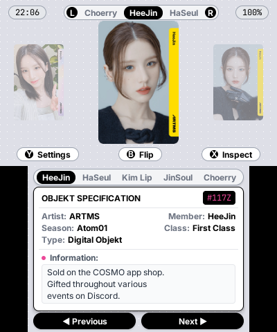
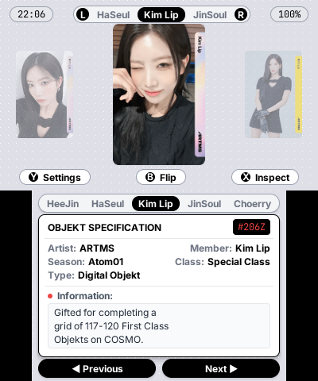
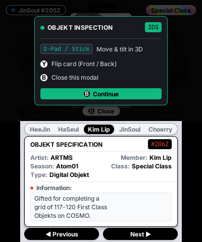
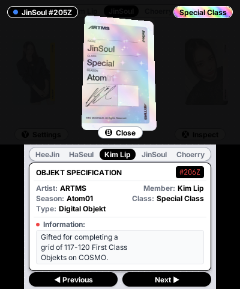
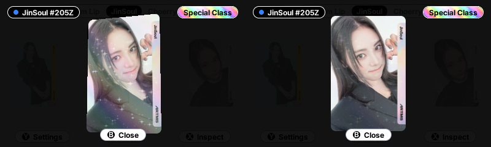

# ARTMS Objekt Collect Book for Nintendo 3DS

An interactive digital photocard collect book application tailored for the **Nintendo 3DS** family of systems (3DS, 3DS XL, 2DS, New 3DS), natively built upon [PocketJS](https://github.com/pocket-stack/pocketjs) using SolidJS and Citro3D GPU hardware acceleration.

Browse, inspect, and organize official **ARTMS (Atom01)** digital photocards ("Objekts") across both screens with **genuine naked-eye autostereoscopic 3D** (hardware parallax barrier), hardware-accelerated holographic foil effects, responsive stylus touch controls, and multi-language support (English, Spanish, and Korean).

---

## Visual Showcase (Direct Hardware Captures)

Images extracted directly from an **Old Nintendo 3DS XL** via the built-in native screenshot pipeline (`sdmc:/screenshots/`):

<p align="center">
  
  &nbsp;&nbsp;&nbsp;&nbsp;
  
</p>
<p align="center">
  
  &nbsp;&nbsp;&nbsp;&nbsp;
  
</p>

### Hardware Stereoscopic 3D (Dual-Eye Framebuffer Dump)

Direct uncompressed 24-bit export of the left and right eye framebuffers driving the console's physical autostereoscopic parallax barrier (`GFX_TOP, GFX_LEFT` and `GFX_TOP, GFX_RIGHT`). Notice the horizontal perspective shift between both views:

<p align="center">
  
</p>

---

## Highlights & Features

### Dual-Screen Interface

- **Top Screen (400×240)**:
  - **Hardware Naked-Eye 3D (Autostereoscopic Parallax Barrier)**: Native hardware stereoscopy powered by `gfxSet3D(true)`. The console's liquid crystal parallax barrier is physically driven to project separate optical views to the left and right eyes without requiring 3D glasses.
  - **Dynamic Depth Slider Integration**: Real-time hardware polling of the physical 3D depth slider via `osGet3DSliderState()`, continuously scaling horizontal interocular distance (IPD) offsets in the Citro3D projection matrix (`gfx_draw_surface_stereo`). Depth smoothly transitions from flat 2D (slider down) to deep pop-out stereoscopy (slider up).
  - **Dual-Eye Framebuffer Pipeline**: Dual independent Citro3D render targets mapped to `GFX_TOP, GFX_LEFT` and `GFX_TOP, GFX_RIGHT`. UI vertices are decoded and packed into linear memory only once, allowing the PICA200 GPU to rasterize both eyes with negligible CPU overhead (<0.15% ARM11 frame time).
  - **3D Perspective Carousel**: Smooth 3D depth showing adjacent Objekts angled in perspective on the left and right, with the active Objekt highlighted at center with clean transparent rounded corners.
  - **Physics-Based Spring-Damper Tilt (`hover-tilt` model)**: Real-time harmonic oscillator physics ($F = -k \cdot x - c \cdot v$ with `stiffness: 0.20`, `damping: 0.72`) driving photocard tilt with organic elastic rebound upon releasing the Circle Pad or D-Pad.
  - **D-Pad Vector Normalization**: Diagonal inputs are projected to the unit circle via `Math.hypot(dx, dy)`, preventing over-rotation and preserving a uniform $\pm 20^\circ$ maximum tilt angle.
  - **Dynamic Z-Elevation (3D Depth Lift)**: Tilting the card dynamically raises its front elevation (`translateZ`) from 15px at rest up to 24px, accentuating physical 3D depth and stereoscopy on the top screen.
  - **Multi-Layer "Cosmos Holo" & Specular Glare (`pokemon-cards-css` architecture)**:
    - **Dynamic Moving Glare Hotspot (`foil_glare.png`)**: A pure white specular light reflection that glides across the photocard face following the tilt angle, modulated by a physical Fresnel reflectance curve (10% at rest, flaring up to 55% at steep angles).
    - **Cosmos Holo 4-Point Starbursts & Stardust (`foil_holo_a.png`, `foil_holo_b.png`)**: Procedural diffraction textures featuring authentic 4-pointed diamond starbursts (`✦` astroid flares), micro-stardust pinpricks, and continuous $-38^\circ$ diagonal rainbow diffraction grating.
    - **360° Polar Incident Light Tracking**: Continuous incident light direction calculation via `Math.atan2(y, x)` cross-fading complementary diffraction phases.
  - **Special Class Holographic Badge (`badge_holo.png`)**: The inspect modal header badge features an authentic silver-prismatic holographic foil background with diamond starbursts and crisp black typography.
  - **Full-Screen 3D Inspect Mode (`Ⓧ`)**: Isolates the photocard in an immersive 3D space. Tilt and rotate freely in real time with the **Circle Pad** or **D-Pad**. Flip the card between its front portrait and official back serial pattern with `Ⓨ`.
  - **Inspect Help Dialog**: Compact in-app overlay showing clear controller keybindings and touch instructions.
  - **Live RTC Clock & Battery Status**: Real-time console hardware clock and battery percentage readout.
  - **Quick Member Navigation**: Compact member indicator with L/R trigger hints.
  - **System Settings Modal (`Ⓨ` in Carousel)**: Configure system preferences, view Citro3D engine status (60 FPS, bilinear filtering), and switch languages on the fly.

- **Bottom Screen (320×240 Touchscreen)**:
  - **Stylus Member Selector**: Quick-tap tabs to jump directly between ARTMS members:
    - 🐰 **HeeJin** (`#ec4899`)
    - 🕊️ **HaSeul** (`#10b981`)
    - 🦉 **Kim Lip** (`#ef4444`)
    - 🐟 **JinSoul** (`#3b82f6`)
    - 🦇 **Choerry** (`#8b5cf6`)
  - **Studio Specification Dossier**: Modern dossier card detailing Artist, Member, Season, Class (First Class / Special Class), Objekt Type, and Serial Number, with active member theme color dynamically accenting the serial number badge.
  - **Adaptive Flex Information Section**: Structured flex box layout with visual weight character wrapping (`charVisualWeight`), ensuring descriptions never clip horizontally or vertically across all three supported languages.
  - **Touch Navigation Bar**: Large stylus-friendly buttons to page through cards effortlessly.

---

### Multi-Language Localization (i18n)

The entire user interface dynamically adapts in real time across three supported languages:

| Language | Default on Boot | Character Rendering & Typography |
| :--- | :---: | :--- |
| **Español** | **Yes** | Accented characters (`á`, `é`, `í`, `ó`, `ú`, `ñ`, `¿`, `¡`) rasterized in Citro3D atlas |
| **English** | No | Full ASCII glyph set |
| **한국어** | No | Authentic CJK Hangul subsetting (`AppleGothic.ttf` fallback) with member names in Korean (`희진`, `하슬`, `김립`, `진솔`, `최리`) and proportional visual width formatting |

*Language can be toggled at any moment inside the **Ajustes / Settings** modal (`Ⓨ`) via D-Pad Left/Right, L/R triggers, the `Ⓐ` button, or touch screen pills.*

---

### On-Device Hardware Screenshot Pipeline
- **Real-Time SD Card Capture**: Trigger an instant screen capture by pressing **`START + SELECT`** (or **`L + R + Y`**) at any time, or by invoking `Native.takeScreenshot()` from JavaScript.
- **Citro3D GPU Display Transfer**: Bypasses post-swap blank framebuffers by untiling PICA200 render targets directly into linear memory via hardware DMA (`C3D_SyncDisplayTransfer` with `GX_TRANSFER_FMT_RGB8`).
- **Mathematical 90° Panel Transposition**: Automatically un-rotates the 3DS panel's native portrait scanlines ($240 \times 400$) into bottom-up BMP rows ($400 \times 240$ and $320 \times 240$) with zero color-space conversion (direct BGR native alignment), achieving ~50 ms writes with zero CPU overhead on the Old 3DS ARM11.
- **Stereoscopic 3D & Touchscreen Triple-Dump**: Saves Left Eye, Right Eye (with 3D parallax offset), and Bottom touchscreen simultaneously to `sdmc:/screenshots/screenshot_YYYYMMDD_HHMMSS_<view>.bmp`.

---

## Controls

| Input | In Carousel / Normal Mode | In 3D Inspect Mode (`Ⓧ`) | Inside Settings Modal (`Ⓨ`) |
| :--- | :--- | :--- | :--- |
| **3D Depth Slider** | **Adjust Naked-Eye 3D depth (2D to Deep 3D)** | **Adjust Naked-Eye 3D depth (2D to Deep 3D)** | Adjust Naked-Eye 3D depth |
| **Circle Pad / Analog** | Page through Objekts (with deadzone) | **Tilt & move card in 3D** | — |
| **D-Pad ◄ / ► / ▲ / ▼** | Navigate previous / next Objekt | **Tilt & move card in 3D** | Change Language |
| **L / R Triggers** | Switch ARTMS member | Switch ARTMS member | Cycle Language |
| **Ⓨ Button** | Open System Settings | **Flip Card (Front / Back)** | Close Settings modal |
| **Ⓑ Button** | Flip Card (Front / Back) | **Close Inspect Mode / Modal** | Close Settings modal |
| **Ⓧ Button** | **Inspect Objekt in 3D** | — | — |
| **Ⓐ Button** | — | — | Cycle Language |
| **START + SELECT** *(or **L + R + Y**)* | **Capture Screenshot to SD (`sdmc:/screenshots/`)** | **Capture Screenshot to SD** | **Capture Screenshot to SD** |
| **Stylus (Touch)** | Tap member tabs, dossier, or buttons | Tap screen or button to dismiss/close | Select language pills directly |
| **L + R + START** | Exit to Homebrew Launcher | Exit to Homebrew Launcher | Exit to Homebrew Launcher |

---

## Architecture & Asset Pipeline

PocketJS targets Nintendo 3DS homebrew using native Citro3D commands on the PICA200 GPU. Because the 3DS GPU requires power-of-two (POT) textures, high-resolution source photocard images and procedural foils are processed through a dedicated pipeline:

1. **Asset Cooking (`scripts/cook-cards.ts`)**:
   - Ingests source card images (`img/cards/*.webp`) and metadata (`cards.json`).
   - Crops and normalizes photocard aspect ratios into **128×256 RGBA PNG** textures with bilinear sampling hints (`images.json`).
   - Generates typed catalogues (`shells/3ds/src/inventory/data.ts`) with member metadata and asset routes.
2. **Procedural Holographic Foils & Glare Pipeline**:
   - Generates 128×256 POT chromatic aberration and Cosmos Holo textures (`foil_holo_a.png`, `foil_holo_b.png`) featuring 4-point diamond starbursts (`✦`) and stardust pinpricks.
   - Generates radial specular glare hotspots (`foil_glare.png`) and dedicated holographic pill badge textures (`badge_holo.png`) with antialiased alpha masking and bilinear hardware sampling (`images.json`).
3. **Font Atlas Generation (`shells/3ds/src/fonts.json`)**:
   - Subsets Latin and Korean Hangul glyphs into the Citro3D font texture atlas, ensuring zero missing characters without bloating VRAM.
4. **Visual Width Typography (`wrapText`)**:
   - Computes proportional font visual weights (1.85× weight for Hangul full-width characters vs 1.0× for Latin) to prevent text overflow on 3DS screens.
5. **Reactive State (`shells/3ds/src/inventory/store.ts`)**:
   - Built on SolidJS primitives (`createSignal`, `createMemo`, `createEffect`) delivering smooth 60 FPS performance on bare metal ARM11.
6. **Autostereoscopic Hardware Pipeline (`patches/naked_eyes_3ds.patch`)**:
   - Powers the console's physical liquid crystal parallax barrier via `gfxSet3D(true)`.
   - Allocates dual Citro3D render targets mapped to `GFX_TOP, GFX_LEFT` and `GFX_TOP, GFX_RIGHT`.
   - Samples the physical depth slider in real time via `osGet3DSliderState()`, continuously scaling horizontal interocular distance (IPD) offsets in the tilted orthographic projection matrix (`gfx_draw_surface_stereo`).
   - Exposes `ui.slider3D()` to QuickJS guest scripts and tracks native modifications reproducibly through `patches/naked_eyes_3ds.patch`.

---

## Getting Started

### Prerequisites

- [Bun](https://bun.sh) (v1.1 or later)
- Git with submodule support
- [Docker Desktop](https://www.docker.com/) (required to build the native `.3dsx` and `.cia` through the devkitARM container)
- [Rust & rustup](https://rustup.rs/) (`nightly-2026-07-02` with `rust-src` component for `armv6k-nintendo-3ds` core compilation)
- A Nintendo 3DS running Luma3DS custom firmware with [Homebrew Launcher](https://github.com/devkitPro/3ds-hbmenu) and [FBI](https://github.com/Steveice10/FBI)

### 1. Clone the Repository

Clone recursively to fetch the `vendor/pocketjs` runtime submodule:

```bash
git clone --recurse-submodules https://github.com/naxoxhide/objeckt_collectbook_pocketjs_3ds.git
cd objeckt_collectbook_pocketjs_3ds
```

### 2. Install Dependencies & Link Runtime

```bash
bun run setup
```
*This installs dependencies and automatically verifies and applies `patches/naked_eyes_3ds.patch` to the `vendor/pocketjs` submodule.*

### 3. Build Options

Depending on your target deployment, run the corresponding build command:

#### A. Full Native Binary (`.3dsx` with Autostereoscopic 3D)
Compiles the complete native Homebrew Launcher executable with liquid-crystal parallax barrier support:
```bash
bun run 3ds
```
Output:
```text
dist/3ds/pocketshell-main.3dsx
```

#### B. Installable CIA Package (`.cia` for HOME Menu)
Compiles both the native `.3dsx` and the installable `.cia` title package for the 3DS HOME Menu:
```bash
bun run 3ds --cia
```
Output:
```text
dist/3ds/pocketshell-main.cia
dist/3ds/pocketshell-main.3dsx
```

#### C. Guest-Only Bundle (`.pocket` for Rapid Hot-Push)
Compiles only the JavaScript + asset bundle for rapid iteration without rebuilding the native C runtime:
```bash
bun run 3ds --pocket-only
```
Output:
```text
dist/3ds/pocketshell-main.pocket
```

---

## Deployment to Nintendo 3DS

### Method A: Over-the-Air via FTP (Recommended)

1. Launch **FTPD** on your 3DS (connected to the same local Wi-Fi). Note the console's IP address.
2. From your terminal, upload the desired package:
   - **For Homebrew Launcher (`.3dsx`)**:
     ```bash
     curl -T dist/3ds/pocketshell-main.3dsx ftp://<CONSOLE-IP>:5000/3ds/pocket-shell.3dsx
     ```
   - **For HOME Menu Installation (`.cia`)**:
     ```bash
     curl --ftp-create-dirs -T dist/3ds/pocketshell-main.cia ftp://<CONSOLE-IP>:5000/cias/pocketshell-main.cia
     ```
     *Then open FBI on your 3DS -> `SD` -> `cias/` -> `pocketshell-main.cia` -> "Install CIA".*
   - **For Staged App Updates (`.pocket`)**:
     ```bash
     curl --ftp-create-dirs -T dist/3ds/pocketshell-main.pocket ftp://<CONSOLE-IP>:5000/pocketjs/runtime/apps/552d35dd1578b13f/pending.pocket
     ```
3. Exit FTPD and launch **Pocket Shell**. Move the 3D depth slider up to enjoy physical naked-eye autostereoscopic 3D!

### Method B: Hot-Push Wire (Pair & Push)

1. **Pair once** while FTPD is open:
   ```bash
   bun run pair --host <CONSOLE-IP>
   ```
2. Launch Pocket Shell on the console and push live updates:
   ```bash
   bun run push --host <CONSOLE-IP>
   ```

### Method C: Manual SD Card Transfer

1. Power off your console and insert the SD card into your PC.
2. Copy `dist/3ds/pocketshell-main.3dsx` to `SD:/3ds/pocket-shell.3dsx` (or copy `pocketshell-main.cia` to `SD:/cias/` and install with FBI).
3. Reinsert the SD card into your 3DS and launch Pocket Shell.

---

## Project Structure

```text
├── cards.json                    # Full Atom01 Objekt database (classes, numbers, descriptions)
├── scripts/
│   └── cook-cards.ts             # Asset pipeline: converts webp cards to 128x256 POT textures
├── shells/
│   └── 3ds/
│       ├── src/
│       │   ├── app.tsx           # 3DS application root entrypoint
│       │   ├── fonts.json        # Font atlas configuration (AppleGothic fallback & CJK glyphs)
│       │   ├── images.json       # Citro3D texture sampling configuration
│       │   ├── cards/            # Baked 128x256 POT card & foil textures
│       │   │   ├── badge_holo.png# Special Class holographic header pill badge
│       │   │   ├── foil_glare.png# Specular moving glare hotspot texture
│       │   │   ├── foil_holo_a.png# Cosmos Holo left-biased diffraction & starbursts
│       │   │   └── foil_holo_b.png# Cosmos Holo right-biased diffraction & starbursts
│       │   ├── wall/             # Background textures and generators
│       │   └── inventory/
│       │       ├── types.ts      # TypeScript interfaces for Objekts and Members
│       │       ├── data.ts       # Generated catalog of ARTMS members and Objekts
│       │       ├── i18n.ts       # Localization dictionary (ES, EN, KO)
│       │       ├── store.ts      # SolidJS reactive state, clock, battery, & inputs
│       │       ├── card-view.tsx # 3D perspective carousel component
│       │       ├── stage.tsx     # Top screen view (400x240), 3D inspect, & modals
│       │       └── deck.tsx      # Bottom screen view (320x240), dossier, & stylus controls
└── vendor/
    └── pocketjs/                 # PocketJS runtime submodule
```

---

## License

This project is distributed under the **GNU General Public License v3 (GPL-3.0-or-later)**.
- PocketJS runtime components remain under the **MIT License**.
- Photocard artwork, imagery, and member trademarks are the property of **MODHAUS** and **ARTMS**. This software is a non-commercial, fan-made homebrew utility.
