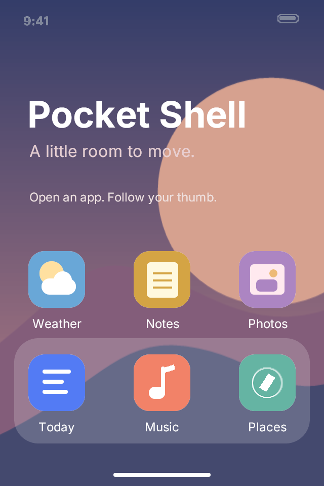
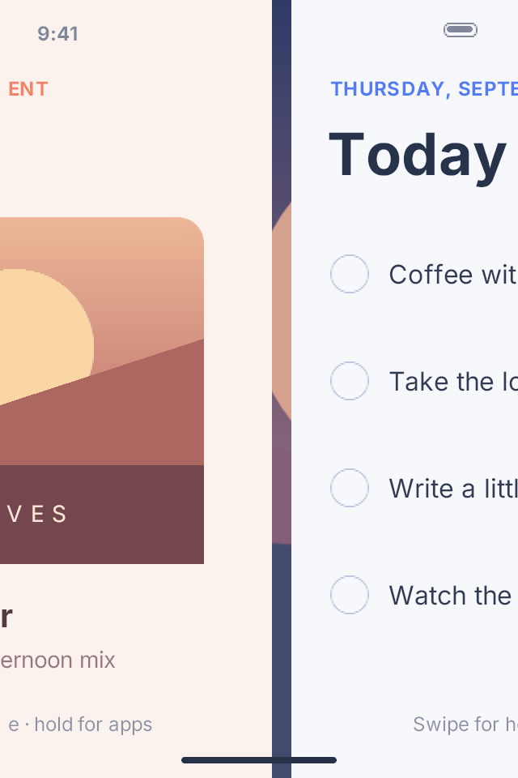

# Pocket Shell Touch

A PocketJS navigation demo for the iPod touch 4's 320 × 480 logical viewport.
Today, Music, Places, Weather, Notes and Photos are six retained views inside one
app. They contain sample content and do not connect to external services.

 

These product screenshots show the desktop and a held quick switch on iPod
touch 4. Per-run captures and telemetry remain in ignored validation output.

| Input | Result |
| --- | --- |
| Swipe up from an app, then release | Minimize the current app and return to the desktop |
| Lift from an app and hold for 220 ms before releasing | Stay in the app switcher |
| Lift the desktop bottom bar, then release | Peek from the left while held, then spring into the switcher |
| Swipe along the bottom edge | Move equal-size neighboring windows together, then spring the chosen window into place |
| Drag across the switcher | Browse overlapping cards with parallax and a spring snap to center |
| Swipe a switcher card upward | Close that window; reverse or cancel to restore it |
| Tap a desktop icon | Expand that app from its icon |
| Drag within an app | Scroll its retained content with inertia and edge resistance |
| Tap Today content | Open its detail view |
| Drag from the detail's left edge | Follow the finger back; reverse to cancel |
| Catch a closing window and drag down | Enlarge it and return to the app |

**A contact captures the displayed window pose.** Its local contact point
remains under the finger as translation and scale change. Bottom-edge
navigation combines horizontal and vertical travel in the same equation. The switcher resolves direction after six points of travel and keeps
that direction until release: horizontal browsing cannot dismiss a card, and
vertical dismissal cannot page the deck. Release chooses a destination
and a critically damped spring continues from the displayed position and
velocity. Cancellation restores the contact's original destination. A second
finger cannot replace the active contact.

**One continuous deck coordinate drives every stacked card.** The grabbed
content point follows horizontal input; cards to its left move less and cards
to its right move more. The same coordinate springs to a centered card on
release. Residual springs preserve each displayed pose when a transition is
caught or a neighbor closes. Paint order and hit order follow the same stack.
Windows covered by the opaque interior of a higher card skip painting. Rounded
corners and translucent cards remain outside that coverage test; hidden content
stays mounted. A mounted-guest pixel comparison checks that culling preserves
the rendered frame.

**The rightmost card is the most recently opened app.** Opening a desktop icon,
opening a switcher card, or completing a quick switch moves that app to the end
of the open-window order. Browsing the switcher does not change recency.

Bottom quick switching uses a separate row with a 12-point gap. Both windows
share scale, height and translation while the finger is down and while the
release spring settles. Consecutive quick switches retain that row's order, so
reversing direction returns to the previous app even after recency changes.
Returning Home or using app content ends that quick-switch chain.

**An upward release from an app defaults to Home after 18 points of travel.**
There is no release-speed requirement. The switcher requires at least 32 points
of lift and a 220 ms hold within a five-point position window. Renewed travel
clears the hold. Background cards stay hidden during an ordinary swipe and
fade into their compact poses during the hold preview. Only the current app
shrinks to its desktop icon on the Home transition.

Desktop entry starts with full-opacity cards outside the left screen edge, at
their switcher size and height. **A held lift reveals at most 48 logical points
of the deck.** Increasing travel adds resistance, independent of the number of
open windows. Reversing the contact takes it back out through the same edge.
Release after 32 points of lift springs the deck into the switcher, preserving
its displayed position and velocity.

The input uses PocketJS `createGesture`, as Pocket Clear does. Content uses
`createScroller`; windows use batched native property updates. Windows and
content remain mounted across destinations. A separate ordered set tracks open
windows. Closing removes the card from hit testing, paging and quick switch;
its content stays mounted. A desktop icon reopens it without duplicate entries.
An empty deck offers a return to the desktop. **Opening an icon or switcher card
expands only that app to full screen.** Neighboring cards keep their compact
geometry and fade out.
**Text cells scale with their positions** through the core's atlas-backed `TEX_QUAD` path. No bitmap screenshot
replaces a live card during the gesture.

## Build and run

Run from the pocket-shell repository root:

```sh
bun run setup
bun run touch guest
bun run check:touch
export POCKETJS_IPODTOUCH4_UDID=<connected-iPod4,1-UDID>
bun run touch doctor
bun run touch deploy
bun run touch launch
bun run touch status --require-action
bun run touch capture
```

The shell owns its portrait app, six mockups, gesture model, assets and tests.
The Omarchy companion remains in `shells/ipod`. The shared runtime, renderer,
UIKit host and installer come from the pinned `vendor/pocketjs` submodule.

`ipodtouch4.json` supplies the external-app descriptor to PocketJS. The native
bundle is `PocketShellTouch.app`; `pocketjs-shell-touch://launch` opens it and
`shell_touch_gesture` identifies completed actions. The installed package ID
`dev.pocket-stack.fluid` remains stable so deployment updates the existing app
and retains its User container. It is a compatibility identifier, not the
shell's display name.

## Validation

```sh
bun run check:touch
bun run touch tunnel
# In another terminal, with the tunnel running:
bun run --cwd shells/touch test:device
```

Model tests cover Home versus held overview intent, bounded desktop peeking,
reversal, cancellation, release velocity, recency, equal-size quick switching,
stack parallax, direction locking, dismissal and reopening. The mounted guest
checks actual touch dispatch, all six icons, retained content, paint bounds and
pixel parity with and without occlusion culling.

The device test compiles its UIKit event sender for this descriptor's bundle
ID. It checks build identity, touch completion, actions, screenshots and frame
timing, then removes the sender. Outputs stay in ignored
`.pocket-build/validation/touch/<run>/`; `POCKET_SHELL_TOUCH_OUTPUT` selects a
run directory. **Injected device input does not measure physical touch-to-photon
latency.** Human touch feel remains a separate acceptance check.

Original shell code and the [wallpaper](src/wallpaper.svg) are GPL-3.0-or-later.
